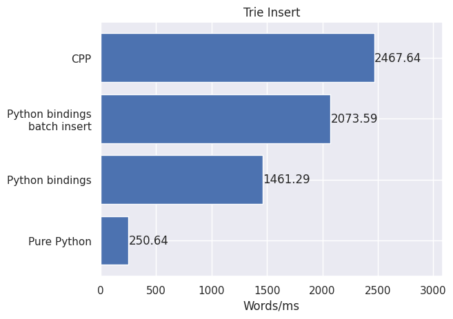
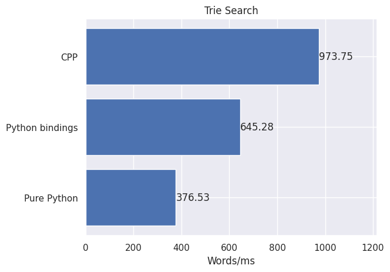

# Trie

This repository contains an implementation of the Trie tree in C++, as well as Python bindings and a pure Python implementation used for benchmarks.

## Building

### libtrie.a (static library)

No dependencies are required to build the static library containing the Trie implementation.

To build libtrie.a, run `make build/libtrie.a`. The output is written under the `build` directory.

### Python bindings (.so)

The bindings are generated using PyBind11, which needs to be installed:

```bash
pip install pybind11
```

To build the shared library, run `make build`. The output is a `trie.*.so` file under the `build` directory.

The .so file can be imported just like any other Python library, as long as it is on the PYTHONPATH:

```python3
import trie

tree = trie.Trie()
```

## Benchmarks

Two benchmarks have been implemented:
1. Insert words into a Trie tree from a given file
2. Search Trie tree for all words in a given file

The file used by the benchmarks in the makefile is rockyou.txt (14m word list taken from https://github.com/kkrypt0nn/wordlists/).

Benchmarks run for:
1. A pure CPP implementation (benchmarks/cpp/benchmark.cpp)
2. Python using CPP bindings (benchmarks/python/benchmark.py)
3. A pure Python implementation (benchmarks/python/benchmark.py using benchmarks/python/baseline/trie.py)

Running `make all` builds the library, the bindings, downloads the rockyou.txt file and runs all benchmarks.

There's also an extra benchmark which uses a batch insert function, ran via `make python_bindings_batch_insert_benchmark`. It uses the CPP bindings in Python, with the difference being that instead of calling the `Trie::insert` function N times, we call the `Trie::insert_batch` function with a list of strings. That benchmark is used to measure whether there's a significant overhead when calling CPP functions from Python.

### Benchmark results

Benchmarks ran on a single core of an Intel i7-8700K processor. The input file was the `rockyou.txt` file mentioned above (14m lines).

#### Insertion



#### Search



#### Memory usage


